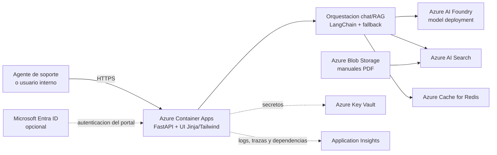

# Arquitectura Azure MVP

## Objetivo

Documentar una arquitectura Azure segura, escalable y mantenible para este asistente de soporte tecnico, alineada con el codigo actual: FastAPI, Azure AI Foundry, Azure AI Search, Redis y manuales tecnicos indexados.

## Diagrama



## Flujos clave

1. El usuario lanza una pregunta desde la UI web.
2. Container Apps ejecuta el backend FastAPI y la orquestacion del chat.
3. La aplicacion recupera contexto desde Azure AI Search, apoyado sobre manuales indexados desde Blob Storage.
4. Redis mantiene sesion corta, cache de respuestas y apoyo al escalado horizontal.
5. Azure AI Foundry genera la respuesta final.

## Seguridad

- HTTPS only en el ingreso publico.
- Secretos en Key Vault y acceso mediante identidad administrada.
- `TrustedHostMiddleware`, CORS explicito y endpoints de debug desactivados por defecto.
- `Microsoft Entra ID` como capa opcional para proteger el portal cuando deje de ser un entorno de demo o piloto.

## Observabilidad

- Application Insights para requests, dependencias hacia Search, Foundry y Redis, excepciones y tiempos de respuesta.
- Logs por stdout y logs funcionales para diagnostico operativo.
- Health probes de Container Apps sobre la API principal.

## Escalado y mantenibilidad

- Container Apps permite scale out por concurrencia HTTP sin romper la sesion, porque Redis saca el estado fuera del contenedor.
- Azure AI Search, Blob y Foundry escalan como servicios gestionados independientes.
- El contenedor sigue siendo reemplazable y versionable, sin secretos embebidos.
- El vectorstore local de LangChain puede mantenerse como optimizacion interna, pero el plano Azure recomendado para produccion ligera toma Blob + AI Search como fuente canonica de documentos.

## Prompt Para Gemini

```text
Genera un diagrama de arquitectura Azure moderno y visualmente atractivo para el repositorio "Asistente IA SAT".

Usa solo iconos oficiales y actuales de Microsoft Azure y Azure AI Foundry. Quiero una composicion limpia, profesional y lista para documentacion de repositorio. No inventes servicios fuera de esta lista.

Componentes obligatorios:
- Usuario interno / agente de soporte
- Azure Container Apps
- Azure AI Foundry
- Azure AI Search
- Azure Cache for Redis
- Azure Blob Storage
- Azure Key Vault
- Application Insights
- Microsoft Entra ID como opcional
- Dentro de Container Apps, indicar: FastAPI + UI Jinja/Tailwind, orquestacion chat/RAG, LangChain + fallback

Flujos a dibujar:
- Usuario -> HTTPS -> Container Apps
- Container Apps -> Azure AI Foundry para generacion de respuesta
- Container Apps -> Azure AI Search para retrieval
- Azure Blob Storage -> Azure AI Search como origen de manuales indexados
- Container Apps -> Azure Cache for Redis para sesion y cache
- Container Apps -> Key Vault para secretos
- Container Apps -> Application Insights para trazas y metricas
- Entra ID -> Container Apps como autenticacion opcional del portal

Etiquetas cortas recomendadas:
- secure MVP
- debug endpoints disabled by default
- managed identity
- scale out with external state in Redis

Titulo sugerido: "Asistente IA SAT - Azure MVP Architecture"
Subtitulo sugerido: "FastAPI support copilot with Foundry, Search and Redis"
```
